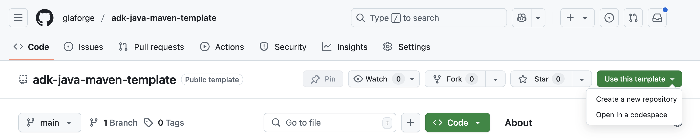
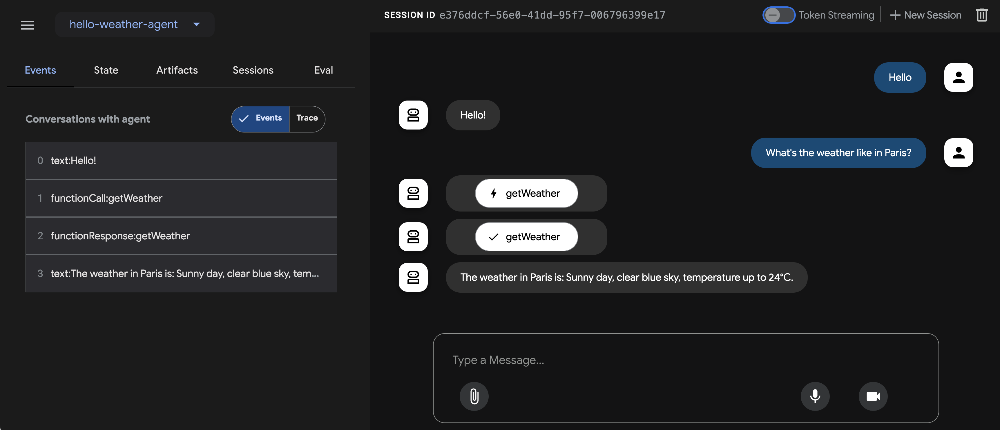

# Template project for building Java agents with ADK

This GitHub repository is a project template to get started creating your first 
agent with [ADK](https://google.github.io/adk-docs/) for Java, the open source
Agent Development Kit, and building with [Maven](https://maven.apache.org).


# Instructions

The following screenshot of the GitHub interface shows how you can use this template project to get started:



> [!TIP]
> * Check out the GitHub [documentation](https://docs.github.com/en/pull-requests/collaborating-with-pull-requests/working-with-forks/fork-a-repo)
> about forking and cloning template projects.
> * Read the [getting started guide](https://google.github.io/adk-docs/get-started/java/).
> * Be sure to read the [ADK documentation](https://google.github.io/adk-docs/get-started/quickstart/#set-up-the-model) 
> to better understand how to configure the model and API key.

# Setup

To use Gemini (or other supported models), you must set up the right environment variables for the model to be properly configured.

Set up the following environment variables:

```shell
export GOOGLE_API_KEY="PASTE_YOUR_ACTUAL_API_KEY_HERE"
export GOOGLE_GENAI_USE_VERTEXAI=FALSE
```

> [!TIP]
> You can get an API key in [Google AI Studio](https://aistudio.google.com/apikey).

> [!IMPORTANT]
> Be sure to replace `"PASTE_YOUR_ACTUAL_API_KEY_HERE"` above, with the value of the key.

# Running the agent

The `HelloWeatherAgent` class is a simple agent configured with one tool to request a canned weather forecast from any city.

There are two options to run your agent: 
* using the ADK Dev UI
* from the command-line

## Running the agent from the Dev UI

The Dev UI offers a useful chat interface to interact with your agent.
Run the command below to launch it, and open a browser at `http://localhost:8080/`.

```shell
mvn compile exec:java -Dexec.mainClass=com.example.agent.HelloWeatherAgent
```

In your browser, you can select the agent in the top left-hand corner and chat with it in the main chat space.
In the left panel, you can explore the various events, including function calls, LLM requests, and responses,
to understand what happens when a user converses with the agent.

Here's a screenshot of the Dev UI in action for your `HelloWeatherAgent` agent:



## Running the agent from the command-line

By default, the `main()` method of this agent launches the ADK Dev UI, on localhost:8080.
You can also comment this line launching the Dev UI and instead uncomment the custom run loop, if you want to run the agent from the terminal.

Type `quit` to exit the agent conversation.

Run the following Maven command to launch the agent in the terminal, after having uncommented the custom run loop:

```shell
mvn compile exec:java -Dexec.mainClass="com.example.agent.HelloWeatherAgent"
```

<details>
<summary>Expand to see the output</summary>

```
[INFO] Scanning for projects...
[INFO] 
[INFO] --------------------< com.example.agent:adk-agents >--------------------
[INFO] Building adk-agents 1.0-SNAPSHOT
[INFO]   from pom.xml
[INFO] --------------------------------[ jar ]---------------------------------
[INFO] 
[INFO] --- resources:3.3.1:resources (default-resources) @ adk-agents ---
[INFO] skip non existing resourceDirectory /Users/glaforge/Projects/adk-java-maven-template/src/main/resources
[INFO] 
[INFO] --- compiler:3.13.0:compile (default-compile) @ adk-agents ---
[INFO] Nothing to compile - all classes are up to date.
[INFO] 
[INFO] --- exec:3.6.1:java (default-cli) @ adk-agents ---

You > What's the weather in Paris?

Agent > The weather in Paris is sunny with a clear blue sky, and the temperature will be up to 24°C.

You > quit
[INFO] ------------------------------------------------------------------------
[INFO] BUILD SUCCESS
[INFO] ------------------------------------------------------------------------
[INFO] Total time:  51.659 s
[INFO] Finished at: 2025-10-12T13:07:47+02:00
[INFO] ------------------------------------------------------------------------
```

</details>

---

> [!NOTE]  
> This template project is not an official Google project 